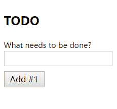

## 安装

- [最简单的方式](https://raw.githubusercontent.com/reactjs/reactjs.org/master/static/html/single-file-example.html)
  - 仅用于新手入门学习测试使用
- [结合 webpack 模块化打包方式](https://reactjs.org/docs/add-react-to-an-existing-app.html)
- [create-react-app 脚手架工具](https://github.com/facebook/create-react-app)
  - 类似于 `Vue CLI`

## 使用 create-react-app 快速体验 React 开发

> create-react-app 类似于 vue-cli

```bash
npm i -g create-react-app
create-react-app my-app
cd my-app
npm start
```

## 最简单的 Hello World

准备：

```bash
mkdir react-demos
cd react-demos
yarn init -y
yarn add react react-dom @babel/standalone
```

Hello World:

```html
<!DOCTYPE html>
<html lang="en">
<head>
  <meta charset="UTF-8">
  <title>Document</title>
</head>
<body>
  <div id="app"></div>
  <script src="node_modules/react/umd/react.development.js"></script>
  <script src="node_modules/react-dom/umd/react-dom.development.js"></script>
  <script src="node_modules/@babel/standalone/babel.js"></script>
  <script type="text/babel">
    ReactDOM.render(
      <h1>Hello world!</h1>,
      document.getElementById('app')
    )
  </script>
</body>
</html>

```

示例说明：

- `react.development.js` 是 React 的核心库
- `react-dom.development.js` 提供与 DOM 相关的功能
- `babel.js` 的作用是将 JSX 语法转为 JavaScript 语法
  - 仅仅用于学习测试使用
  - 实际开发会使用 webpack 结合 babel 编译打包
- `<script>` 标签的 `type` 属性为 `text/babel` 。这是因为 React 独有的 JSX 语法，跟 JavaScript 不兼容。凡是使用 JSX 的地方，都要加上 `type="text/babel"`

## 组件

## 起步实例：TODO


